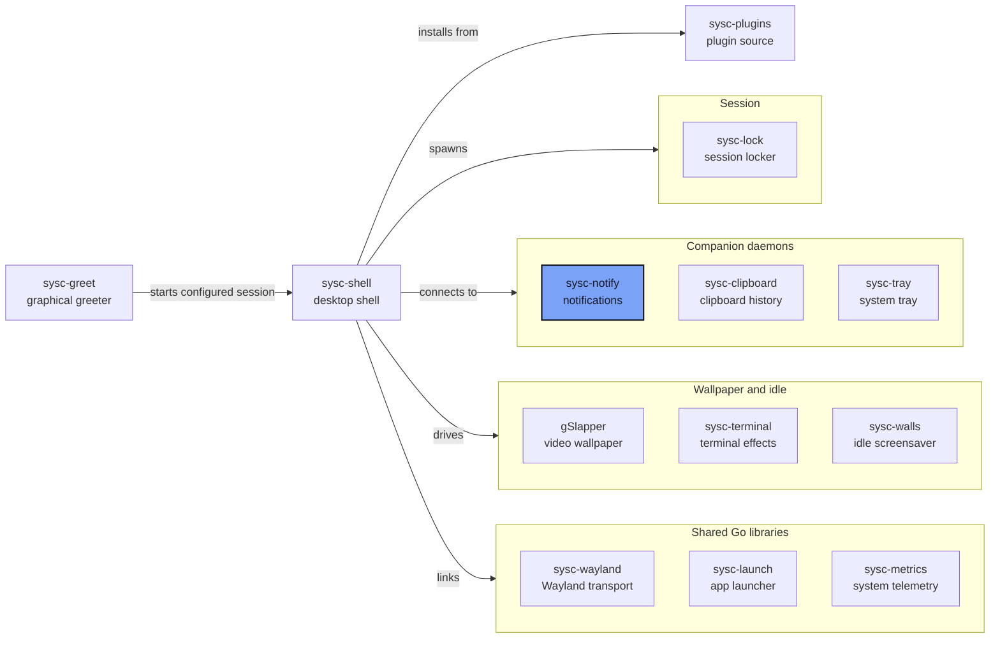

<p align="center"></p>

<p align="center"><strong>A notification daemon for Wayland, written in Go.</strong></p>

<p align="center">Owns <code>org.freedesktop.Notifications</code>, implements the Freedesktop spec, and hands the notifications to sysc-shell to draw.</p>

## What it is

sysc-notify is the notification daemon behind [sysc-shell](https://github.com/Nomadcxx/sysc-shell).
It claims the `org.freedesktop.Notifications` name on the session bus, so every app that sends a
notification talks to it. It keeps the notification state — active popups, expiry, history — and
streams it to the shell over a private Unix socket. The shell draws the popups and sends back what
you clicked.

The daemon keeps notification state across shell restarts and sends a snapshot when the shell
reconnects. Snapshot images may be omitted to fit the frame-size limit.

## How it fits together



[The sysc ecosystem](https://github.com/Nomadcxx/sysc-shell/blob/main/docs/ecosystem.md) explains
each connection, socket and version pin.

## Features

- **Freedesktop Notifications spec 1.3**: replacement IDs, expiry, actions, close reasons, and the
  `NotificationClosed`, `ActionInvoked` and `NotificationReplied` signals
- **Inline replies**: advertises `inline-reply` and honours `x-kde-reply-placeholder-text`
- **Images**: `image-data`, `image_data` and `icon_data`, scaled to a 512 px long edge;
  `image-path` forwards an icon name or absolute path
- **Progress and urgency**: the `value` hint accepts integers from 0–100 and rejects other values; urgency is preserved
- **History**: up to 100 closed notifications for 7 days, with seen/unseen state; transient and
  private notifications are excluded
- **Survives shell restarts**: the presenter socket is independent of D-Bus, and every reconnect
  gets a state snapshot
- **Sender tracking**: records the sending process and its ancestry, so the shell can focus the
  right window
- **Plugin toasts**: a producer protocol lets shell plugins publish and close their own notifications
- **Hardened socket**: `0600` in a `0700` directory, same-UID peer check, symlink rejection, stale
  socket cleanup
- **Bounded resources**: 128 active notifications, 16 KiB bodies, 6 action pairs, 64 hints, and
  size caps on images and frames

## Install

### Requirements

Go 1.26+ and a D-Bus session bus.

### From source

```bash
git clone https://github.com/Nomadcxx/sysc-notify
cd sysc-notify
go build -o ~/.local/bin/sysc-notify ./cmd/sysc-notify
export PATH="$HOME/.local/bin:$PATH"
```

Or:

```bash
GOBIN="$HOME/.local/bin" go install github.com/Nomadcxx/sysc-notify/cmd/sysc-notify@latest
export PATH="$HOME/.local/bin:$PATH"
```

### As a user service

```bash
install -Dm644 contrib/sysc-notify.service ~/.config/systemd/user/sysc-notify.service
systemctl --user daemon-reload
systemctl --user enable --now sysc-notify.service
```

> **Warning**: stop mako, dunst or swaync first. Only one process can own
> `org.freedesktop.Notifications`, and D-Bus activation may start another daemon behind your back.

## Usage

sysc-notify has no CLI flags; it runs as a daemon. The shell connects to
`$XDG_RUNTIME_DIR/sysc-notify/presenter.v1.sock` and speaks length-prefixed JSON frames. The
wire protocol is version 1.2; `v1` in the socket name denotes the major version. The protocol
package is public:

Run inside an existing Go module:

```bash
go get github.com/Nomadcxx/sysc-notify/protocol
```

## Documentation

- [The sysc ecosystem](https://github.com/Nomadcxx/sysc-shell/blob/main/docs/ecosystem.md)
- [sysc-shell](https://github.com/Nomadcxx/sysc-shell) — the shell that presents these notifications

## License

BSD-3-Clause.

---

<a href="https://github.com/Nomadcxx"></a> — terminal-native tooling for the linux desktop.
[More projects →](https://github.com/Nomadcxx) · [Sponsor](https://github.com/sponsors/Nomadcxx) ❤️
